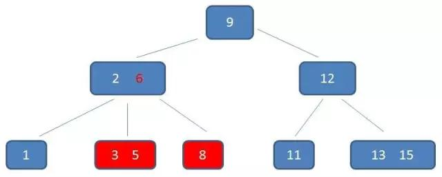

## B+树

B+树是基于B-树的一种变体，有着比B-树更高的查询性能。

在细说B+树之前，我们先了回顾B-树的几大特征：

#### 一个m阶B树具有如下几个特征：

1. 根结点至少有2个孩子结点
2. 每个非叶子结点都包含k-1个元素和k个孩子，其中`m/2 <= k <= m`
3. 每个叶子结点都包含k-1个元素，其中`m/2 <= k <= m`
4. 所有的叶子结点都位于同一层。
5. 每个结点中的元素从小到大排列，结点当中k-1个元素正好是k个汉字包含的元素的值域分区

B+树和b-树具有一些相共同点，但是B+树也具备一些新的特性。

#### 一个M阶B+树具有如下特性：

1. 有k个子树的非叶子结点包含k个元素(B树中是k-1个元素)，每个元素不保存数据，只用来索引，所有数据都保存在叶子结点。
2. 所有的叶子结点中包含了全部元素的信息，及指向含有这些元素记录的指针，且叶子结点本身依次按关键字的大小自小到大的顺序链接。
3. 所有的非叶子结点元素都同事存在于子结点，在子结点元素中是最大（或最小）元素

下面看看具体的例子

从图中可以看到，每个父结点的元素都出现在子结点中，是子结点中的最大（或最小）的元素。

在上面这棵树中，根结点元素8是子结点（2,5,8）的最大元素，也是叶子结点（6,8）的最大元素。

根结点元素15是子结点11,15的最大元素，也是叶子结点13,15的最大元素。

需要注意的是，根结点的最大元素，也就等同于整个B+树的最大元素。以后无论插入删除多少元素，是重要保持最大元素在根结点。至于叶子结点，由于父结点的元素都出现在叶子结点，因此所有叶子结点包含了全量元素信息。并且每一个叶子结点都带有指向下一个结点的指针，形成了一个有序链表。

B+树还具有一个特点，这个特点就是除了索引之外，最重要的特点[卫星数据]的位置。

所谓卫星数据，指的是索引元素所指向的数据记录，比如数据库中的某一行。在B-树中，无论中间结点还是叶子结点都带有卫星数据。

##### B-树中的卫星数据（Satellite Information):

而在B+树当中，只有叶子结点带有卫星数据，其余中间结点仅仅是索引，没有任何数据关联。

##### B+树中的卫星数据（Satellite Information）:

需要补充的是，在数据库的聚蔟索引（Cluster Index）中，叶子结点直接包含卫星数据。在非聚蔟索引(NonClustered Index)中，叶子结点带有指向卫星数据的指针。

##### B+树的查询性能体现

假设我们要查找的是元素3

磁盘第一次IO：

磁盘第二次IO:

磁盘第三次IO:

B+树的查询与B-树有两点不同，首先，B+树的中间结点没有卫星数据，所以同样大小的磁盘页能容纳更多的元素数据。这就意味着，数据量相同的情况下，B+树的结构比B-树更加“矮壮”，这就意味着磁盘IO查询次数也越少。

其次，B+树的查询必须最终查询到叶子结点，而B-树只需要匹配元素即可，无论元素处于中间结点还是叶子结点。因此，B-的查询是不稳定的（最好的情况是查询到根结点，最坏的情况是查询到叶子结点），而B+树的查询是稳定的。

下面我们来看看查询范围，假设我们要查询的范围是3代11的元素：

***

##### B-树的查询范围

B-树如何做范围查询呢？只能依靠繁琐的中序遍历。

1. 自顶向下，查找到范围下限3：
   

2. 中序遍历到6：

   

3. 中序遍历到8：

   

4. 中序遍历到9：

   

5. 中序遍历到11，遍历结束

   

从上图可以看出，B-树的范围查询确实很繁琐，反观B+树的范围查询，则要简单得多，只需要在链表上做遍历即可：

##### B+树的范围查找过程

1. 自顶向下，查找到范围的下限3：

   

2. 通过链表指针，遍历到元素6，8：

   

3. 通过链表指针，遍历到元素9,11，遍历结束：

   

综合起来，B+树相比B-树的优势有三个：1.IO次数更少；2.查询性能稳定；3.范围查询简便。

至于B+树的插入和删除，过程与B-树大同小异

#### 总结

**B+树的特征：**

1. 有k个子树的中间节点包含有k个元素（B树中是k-1个元素），每个元素不保存数据，只用来索引，所有数据都保存在叶子节点。
2. 所有的叶子结点中包含了全部元素的信息，及指向含这些元素记录的指针，且叶子结点本身依关键字的大小自小而大顺序链接。
3. 所有的中间节点元素都同时存在于子节点，在子节点元素中是最大（或最小）元素。

**B+树的优势：**

1. 单一节点存储更多的元素，使得查询的IO次数更少。
2. 所有查询都要查找到叶子节点，查询性能稳定。
3. 所有叶子节点形成有序链表，便于范围查询。