## B-树

Mysql数据库，里面的索引是基于Hash表或者B+树

> “数据库索引为什么要是用树结构存储呢？” 
>
> "因为树的查找效率高，而且可以保持有序。" 
>
> "既然这样，为什么索引没有使用二叉查找树来实现呢？“   
>
> "二叉查找树查询的时间复杂度是O(log N)，性能以及足够高了，难道B树可以比它更快?"
>
> "其实从算法逻辑角度来讲，二叉查找树的查找速度和比较次数都是最小的。但是，我们不得不考虑一个现实的问题：磁盘IO。数据库索引是存储在磁盘上的，当数据量比较大的时候，索引的大小可能有几个G甚至更多。当我们利用索引查询的时候，能把这个索引全部加载到内存吗？显然不可能。能做的只有逐一加载每一个磁盘页，这里的磁盘页对应着索引树的节点。"

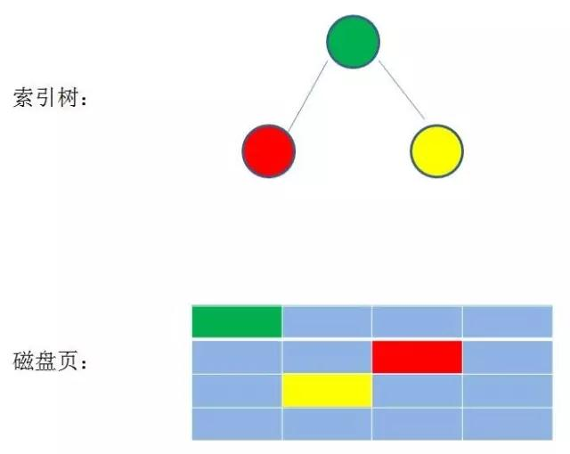

如果我们利用二叉查找树做为索引结果，情形是什么样呢？假设树的高度是4，查找的值是10，那么流程如下：

二叉查找树的结构：

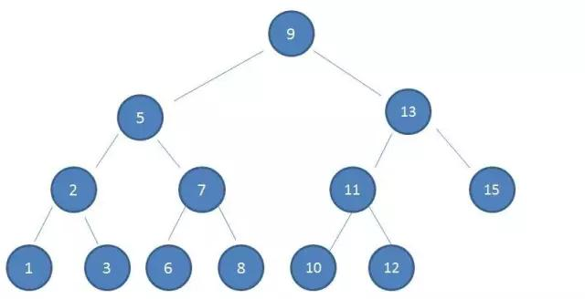

磁盘第一次IO：

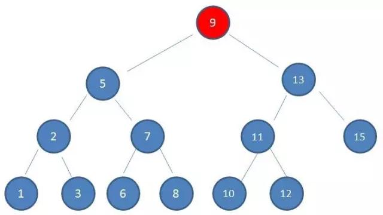

磁盘第二次IO：

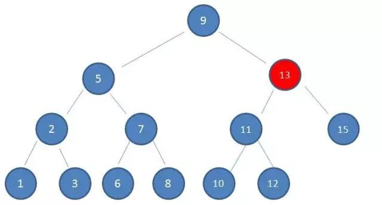

磁盘第三次IO：

磁盘第四次IO：

磁盘IO的次数是4次，索引树的高度也是4。所以最坏情况下，磁盘IO次数等于索引树的高度。

既然如此，**为了减少磁盘IO次数**，我们需要把原本**“瘦高”**的树结构变得**“矮胖”**。也就是B-树的特征之一。

B树是一种多路平衡查找树，它的每一个节点最多包含k个孩子，k被称为B树的阶。k的大小取决于磁盘页的大小。

#### B-树(Balance Tree)，一个m阶的B树具有如下几个特征:

1. 根结点至少有两个子孩子结点。
2. 每个非叶子结点都包含k-1个元素和k个孩子，其中`m/2 <= k <= m`
3. 每一个叶子结点都包含k-1个元素，其中`m/2 <= k <= m`
4. 所有的叶子结点都位于同一层。
5. 每个结点中的元素从小到大排列，结点当中k-1个元素正好是是k个孩子包含的元素的值域的分片。

下面我们以一个3阶B-树为例，来看看B-树的具体结构。树中的具体元素和刚才的二叉查找树是一样的。

这棵树中，咱们重点来看(2,6)结点。该结点有两个元素2和6，又有三个孩子1，（3，5），8。其中1小于2，（3，5）在元素2，6之间，8大于（3，5），正好符合刚刚所列的几条特征。

下面我们来演示下B-树的查询过程，假设我们要查找的值是5：

1. 第一次磁盘IO：

   

2. 在内存中定位（和9比较）：

   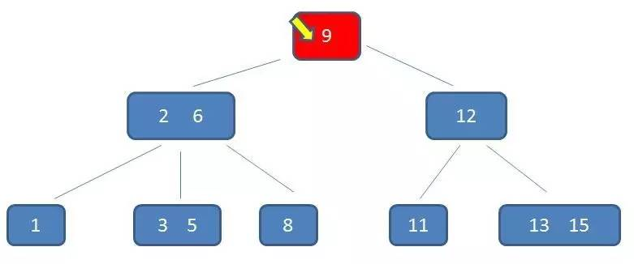

3. 第二次磁盘IO：

   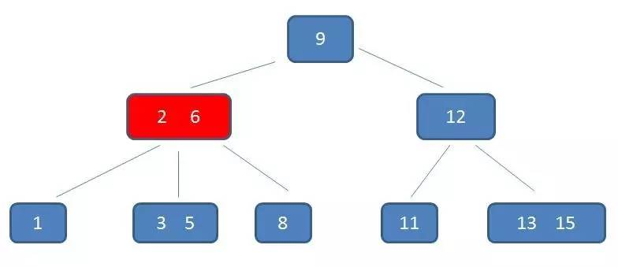

4. 在内存中定位（和2,6比较）：

   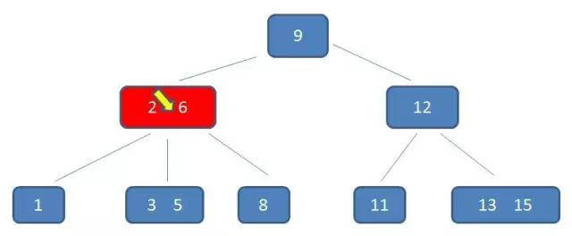

5. 第三次磁盘IO：

   

6. 在内存中定位（和3，5比较）：

   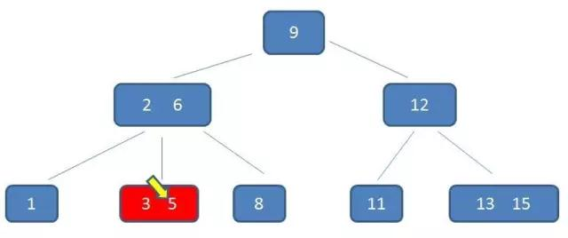

   ​

通过整个流程我们可以看出，B-树在查询中比较次数其实不必二叉查找树烧，尤其是单一结点的元素数量很多时。

可是相比磁盘IO速度，内存中的比较耗时几乎可以忽略。所以只要树的高度足够低，IO次数足够少，就可以提升查找性能。

相比之下结点内部元素多一些也没有关系，仅仅是多了几次内存交换，只要不超过磁盘页的大小即可。这是B-树的优势之一。

***

那么B-树是如何做插入和删除的呢？

我们举一个典型的例子，加入我们要插入的值4：

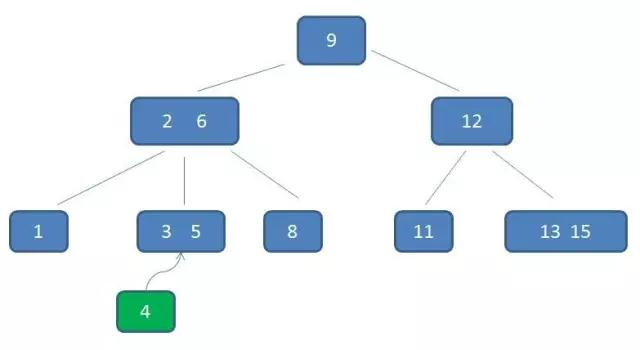

结点（3，5）已经是两元素结点，无法在增加。父亲结点（2，6）也是两元素结点，也无法再增加。根结点9是单元素结点，可以升级为两元素结点。于是**拆分**结点3，5与2，6，让根结点9升级为两元素结点4,9。结点6独立为根结点的第二个孩子。

就为了插入一个元素，让整个B树那么多结点都发生了连锁改变。但正因为如此，让B-树能够始终维持多路平衡。这也是B-树的一大优势：**自平衡**

下面我们再来说一说B-树删除的过程。同样只举一个典型的例子，删除元素11

自顶向下查找元素11的结点位置。

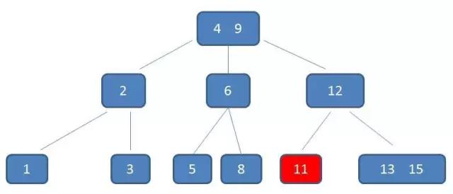

删除11后，结点12只有一个孩子，不符合B树的规范。因此找出12,13,15三个结点的中位数13，取代结点12，而结点12自身下移成为13的左孩子。（这个过程成为**左旋**）

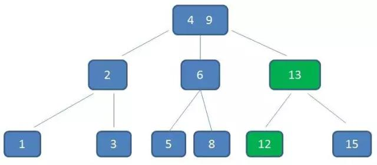

以上就是B-树的插入和删除。B-树主要应用于文件系统以及部分数据库索引，比如著名的非关系型数据库MongoDB。

而大部分关系型数据库，比如Mysql则使用B+树做为索引。
