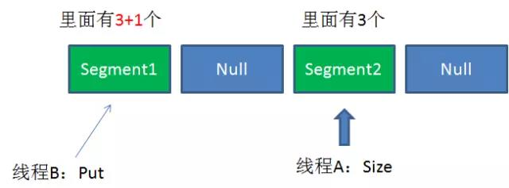

# ConcurrentHashMap

掌握了HashMap之后，再学习ConcurrentHashMap其实很简单，最关键的是要理解一个概念：**分段[Segment]**。

**Segment**是什么呢？Segment本身其实就相当于一个**二级HashMap对象**

同HashMap一样，Segment包换一个**HashEntry数组**，数组中每一个HashEntry既是一个**键值对**，也是一个**链表的头结点**。

单一的Segment结构如下：


像这样的Segment对象，在ConcurrentHashMap集合中有多少个呢？有$2^N$ 个，共同保存在一个名为Segments的数组中。

因此整个ConcurrentHashMap的结构如下：


可以说，ConcurrentHashMap是一个二级哈希表。在一个总的哈希表下面，有若干子哈希表。

这样的二级结构，和数据库水平拆分有些相似。

*--ConcurrentHashMap这样的设计有什么好处呢？*

*--ConcurrentHashMap优势就是采用了[锁分段技术]，每一个Segment就好比一个自治区。读写操作高度自治，Segment之间互不影响*


下面来看看几个ConcurrentHashMap并发读写的几种情况：

***

#### Case1 : 不同Segment的并发写入


不同的Segment写入是可以并发执行的。

#### Case2 : 同一Segment的一写一读


同一Segment的写和读是可以并发执行的。

#### Case3 : 同一Segment的并发写入


Segment的写入是需要上锁的，因此对同一Segment的并发写入会被阻塞。

由此可见，ConcurrentHashMap当中每个Segment各自持有一把锁。在保证线程安全的同时，降低了锁的粒度，让并发操作效率更高。


### ConcurrentHashMap的读写过程：

***

#### Get方法：

1. 为输入的key做Hash运算，得到hash值。
2. 通过hash值，定位到对应的Segment对象。
3. 再次通过hash值，定位到Segment当中数组的具体位置。


#### Put方法：

1. 为输入的key做Hash运算，得到hash值。
2. 通过hash值，定位到对应的Segment对象。
3. 获取可冲入锁
4. 再次通过hash值，定位到Segment对象中数组的具体位置。
5. 插入或覆盖HashEntry对象。
6. 释放锁。


从步骤可以看出，ConcurrentHashMap在读写时都需要二次定位。首先定位到Segment，之后定位到Segment内的具体数组下标。


### ConcurrentHashMap一致性问题

既然每一个Segment都各自加锁，那么在调用Size方法的时候，怎么解决一致性问题呢?

Size方法的目的是统计ConcurrentHashMap的总元素数量，自然需要把各个Segment内部的元素数量汇总起来。

但是，如果在统计Segment元素数量的过程中，已统计过的Segment瞬间插入新的元素，这时候该怎么办呢？





关于这一点，让我们看一看ConcurrentHashMap的Size操作是怎样工作的：

**ConcurrentHashMap的Size方法是一个嵌套循环，大体逻辑如下：**

1. 遍历所有的Segment。
2. 把所有的Segment的元素数量累加起来。
3. 把Segment的修改次数累加起来。
4. 判断所有Segment的总修改次数是否大于上一次的总修改次数。如果大于，说明统计过程中有修改，重新统计，尝试次数+1；如果不是，说明没有修改，统计结束。
5. 如果尝试次数超过阈值，则对每一个Segment加锁，再重新统计。
6. 再次判断所有Segment的总修改次数是否大于上一次的总修改次数。由于已经加锁，次数一定和上次相等。
7. 释放锁，统计结束。


官方源代码如下：

```java
public int size() {
	// Try a few times to get accurate count. On failure due to
	// continuous async changes in table, resort to locking.
	final Segment<K,V>[] segments = this.segments;
    int size;
    boolean overflow; // true if size overflows 32 bits
    long sum;         // sum of modCounts
    long last = 0L;   // previous sum
    int retries = -1; // first iteration isn't retry
    try {
        for (;;) {
            if (retries++ == RETRIES_BEFORE_LOCK) {
                for (int j = 0; j < segments.length; ++j)
                    ensureSegment(j).lock(); // force creation
            }
            sum = 0L;
            size = 0;
            overflow = false;
            for (int j = 0; j < segments.length; ++j) {
                Segment<K,V> seg = segmentAt(segments,j);
                if (seg != null) {
                    sum += seg.modCount;
                    int c = seg.count;
                    if (c < 0 || (size += c) < 0)
                        overflow = true;
                }
            }
            if (sum == last)
                break;
            last = sum;
        }
    } finally {
        if (retries > RETRIES_BEFORE_LOCK) {
            for (int j = 0; j < segments.length; ++j)
                segmentAt(segments, j).unlock();
        }
    }
    return overflow ? Integer.MAX_VALUE : size;
}
```

为什么这样设计呢？这种思想和乐观锁悲观锁的思想如出一辙。

为了尽量不锁住所有的Segment，首先乐观地假设Size过程中不会有修改。当尝试次数超过阈值时，才无奈转为悲观锁，锁住所有的Segment保证强一致性。


#### 说明

1. 这里介绍的都是ConcurrentHashMap的原理和代码，都是基于java 1.7的。在java1.8中会有些许差别。
2. ConcurrentHashMap在对key求Hash值的时候，为了实现Segment均匀分布，进行了两次Hash。