## HashMap

#### 一.原理

​	众所周知，HashMap是一个用于存储**Key-Value键值对**的**集合**，每一个键值对也叫做**Entry**。这些个键值对(Entry)分散存储在一个数组当中，每个数组就是HashMap的主干。

​	HashMap数组每一个元素的初始值都是Null。

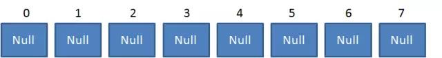	 

对于HashMap，我们最常使用的是两个方法：**Get**和**Put**。


##### 	1. Put方法的原理

​	调用Put方法的时候发生了什么呢？

​	比如调用HashMap.put("apple",0)，插入一个Key为“apple”的元素。这时候我们需要利用一个哈希函数来确定Entry的插入位置(index):

​	**index = hash("apple")；**

​	假定最后计算出的index是2，那么结果如下：

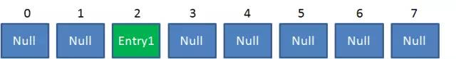

​	但是，因为HashMap的长度是有限的，当插入的Entry越来越多时，再完美的Hash函数也难免会出现index冲突的情况。比如下面这样：

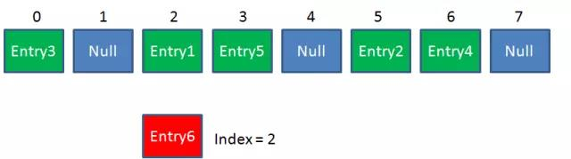

​	这时候该怎么办呢？我们可以利用**链表**来解决。

​	HashMap数组的每一个元素不止是一个Entry对象，也是一个链表的头结点。每一个Entry对象通过Next指针指向它的下一个Entry结点。当新来的Entry映射到冲突的数组位置时，只需要插入到对应的链表头部即可：

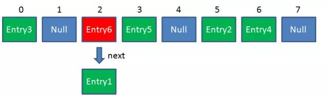

​	需要注意的是，新来的Entry结点插入链表时，使用的是“头插法”。至于为什么不插入链表尾部，后面会有解释。


#####	2. Get方法的原理

​	使用Get方法根据Key来查找Value的时候，发生了什么呢？

​	首先会把输入的Key做一次Hash映射，得到对应的index:

​	**index = hash ("apple");**

​	由于刚才所说的Hash冲突，同一个位置可能匹配到多个Entry，这时候就需要顺着对应链表的头结点，一个一个往下查找。假设我们要查找的Key是“apple"：

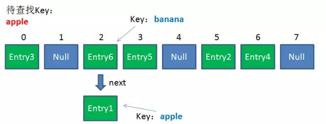 

​	第一步，我们查看的是头结点Entry6，Entry6的Key是"banana"，显然不是我们要找的结果。

​	第二部，我们查看的是Next结点Entry1，Entry1的Key是"apple"，正是我们要找的结果。

​	之所以把Entry6放在头结点，是因为HashMap的发明者认为，**后插入的Entry被查找的可能性更大。**


***


#### 二.HashMap的默认长度

​	之前说出，从Key映射到HashMap数组的对应位置，会用到一个Hash函数：

​	**index = hash ("apple");**

​	如何实现一个尽量均匀分布的Hash函数呢？我们通过利用Key的HashCode值来做某种运算。为了实现高效的Hash算法，HashMap的发明者采用了位运算的方式。有如下公式(Length是HashMap的长度)：

​	**index = HashCode(K而已） & (Length-1)**

​	下面我们以值为"book"的Key来演示整个过程：

​	1.计算机"book"的hashcode，结果为十进制数3029737，二进制数`10 1110 0011 1010 1110 1001`。

​	2.假定HashMap长度是默认的16，计算Length-1的结果为十进制数15，二进制数`1111`。

​	3.把以上两个结果做**与运算**，

​	`10 1110  0011 1010 1110 1001 & 1111 = 1001`， 十进制数是9，所以index = 9。

​	可以说，Hash算法最终得到的index结果，完全取决于Key的HashCode值得最后几位。


​	--*这样的方式有什么好处呢？为什么长度必须是16或者**2的幂**?比如HashMap长度是10会怎么样？*

​	--*这样做不但效果上等同于取模，而且还大大提高了性能。至于为什么采用16，我们可以试试长度是10会出现什么问题。*

​	

​	假设HashMap的长度是10，重复刚才的运算步骤：

|  HashCode:  | 10 1110 0011 1010 1110 1001 |
| :---------: | --------------------------: |
| Length - 1: |                        1011 |
|   Index:    |                    **1001** |

​	单独看这个结果，表面上并没有问题。我们再来尝试一下新的HashCode 10 1110 0011 1010 1110 **1011**：

|  HashCode：  | 10 1110 0011 1010 1110 1011 |
| :---------: | --------------------------: |
| Length - 1: |                        1001 |
|    Index    |                    **1001** |

​	让我们再换一个HashCode 10 1110 0011 1010 1110 1111 试试：

|  HashCode：  | 10 1110 0011 1010 1110 1111 |
| :---------: | --------------------------: |
| Length - 1: |                        1001 |
|   Index :   |                    **1001** |


​	是的，虽然HashCode的倒数第二第三位从0变成了1，但是运算的结果都是1001。也就是说，当HashMap长度为10的时候，有些index结果的出现几率会更大，而有些index结果永远不会出现（比如0111）!

​	这样，显然不符合Hash算法均匀分布的原则。

​	反观长度16或者其他2的幂，Length - 1的值是所有二进制位全为1，这种情况下，index的结果等同于HashCode后几位的值。只要输入的HashCode本身分布均匀，Hash算法的结果就是均匀的。	


***


​	

#### 三.高并发下的HashMap

​	HashMap的容量是有限的。当经过多次元素插入，使得HashMap达到一定饱和度时，Key映射位置发生冲突的几率会逐渐提高。

​	这时候，HashMap需要扩展它的长度，也就是进行**Resize。**

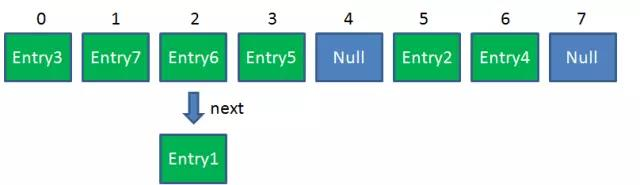

##### 	1 . 影响发生Resize的因素有两个：

###### a . Capacity

​	HashMap的当前长度，是2的幂。

######		b . LoadFactor

​	HashMap负载因子，默认值为0.75f。


​	衡量HashMap是否需要进行Resize的条件如下：

 	**HashMap.Size >=  Capacity ** ***** **LoadFactor **


#####	2 . HashMap的Resize过程

###### 	a . 扩容

​	创建一个新的Entry空数组，长度是原数组的2倍。

###### b . ReHash

​	遍历原Entry数组，把所有的Entry重新Hash到新数组。为什么要重新Hash呢？因为长度扩大以后，Hash的规则也随之改变。

​	

让我没回顾一下Hash公式：

**index = HashCode ( Key ) & ( Length - 1 )**


​	当原数组长度为8时，Hash运算是和111B做与运算；新数组长度为16，Hash运算是和111B做与运算。Hash结果显然不同。


**Resize前的HashMap：**


**Resize后的HashMap :**

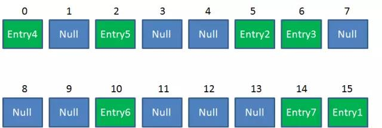


**ReHash的Java代码如下:**

```java
/**
 *Transfer all entries from current table to newTable
 */
void transfer(Entry[] newTable, boolean rehash){
  int newCapacity = new Table.length;
  for(Entry<K,V> e : table){
    while(null != e){
      Entry<K,V> next = e.next;
      if(rehash){
        e.hash = null == e.key ? 0 : hash(e.key);
      }
      int i = indexFor(e.hash, newCapacity);
      e.next = newTable[i];
      newTable[i] = e;
      e = next;
    }
  }
}
```

​	刚才的流程在单线程下执行并没有问题，可惜HashMap并非线程安全的。下面来演示一下，在多线程环境中，HashMap的Rehash操作可能带来什么样的问题：


#####	3. 演示多线程环境下的HashMap

​	假设一个HashMap已经到了Resize的临界点。此时有两个线程A和B，在同一时刻对HashMap进行Put操作：

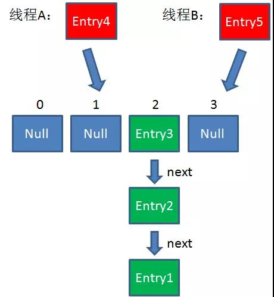

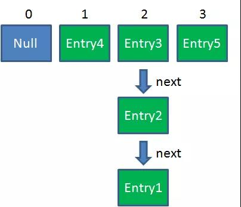

​	  此时达到了Resize条件，两个线程各自进行Resize第一步，也就是扩容：

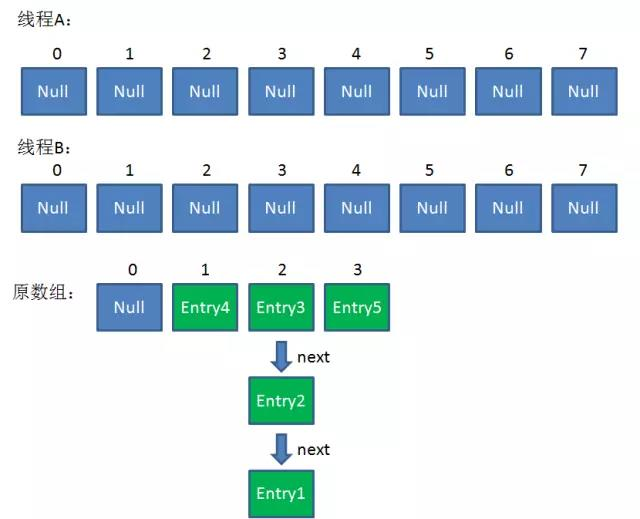

​	这时候，两个线程都走到了ReHash的步骤。让我们回顾一下ReHash的代码：

```java
void transfer(Entry[] newTable, boolean rehash){
  int newCapacity = new Table.length;
  for(Entry<K,V> e : table){
    while(null != e){
      Entry<K,V> next = e.next;
      if(rehash){
        e.hash = null == e.key ? 0 : hash(e.key);
      }
      int i = indexFor(e.hash, newCapacity);
      e.next = newTable[i];
      newTable[i] = e;
      e = next;
    }
  }
}
```

​	假设此时线程B遍历到Entry3对象，刚执行完红框里的这行代码，线程就被挂起。对于线程B来说：	

`e = Entry3`

`next = Entry2`

​	这时候线程A畅通无阻地进行着Rehash，当ReHash完成后，结果如下(图中的e和next，代表线程B的两个引用)：

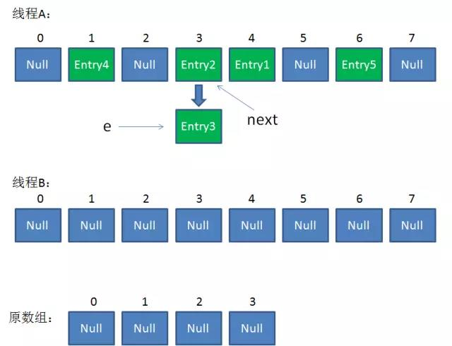 

​	直到这一步，看起来没什么毛病。接下来线程B回复，继续执行属于它自己的ReHash。线程B刚才的状态是：

​	