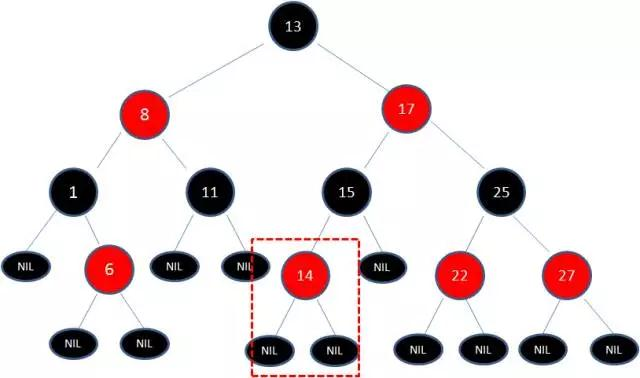

## 红黑树

要学习红黑树，现需要理解二叉查找树（Binary Search Tree）

#### 二叉查找树

二叉查找树（BST）具备什么特性呢？

1. **左**子树上所有的结点的值均**小于等于**它的根结点的值。
2. **右**子树上所有的结点的值均**大于等于**它的根结点的值。
3. 左、右子树也分别为二叉排序树

下图中这棵树，就是一颗典型的二叉查找树：

这样的数据结构有什么好处呢？我们来试着查找一下值为10的结点。

1. 查找根结点9：

   

2. 由于10 > 9 ,因此查看右孩子13：

   

3. 由于10 < 13 ，因此查看左孩子11：

   

4. 由于**10 < 11**，因此查看左孩子**10**，发现10正是要查找的结点：

   

这种方式正是二分查找的思想，查找所需的最大次数等同于二叉查找树的高度。在插入结点的时候也是利用类似的方法，通过一层一层比较大小，找到新结点适合插入的位置。

然而，二叉查找树任然存在它的缺陷，缺陷体现在插入新结点的时候，我们来看看下面这种情形：

假设初始的二叉查找树只有三个结点，根结点的值为9，左孩子值为8，右孩子值为12：

接下来我们依次插入如下五个结点：7、6、5、4、3.依照二叉树查找树的特性，结果会变成什么样呢？

经过一系列插入后，二叉查找树的形态发生了改变，虽然这样的形态也符合二叉查找树的特性，但是查找性能却大打折扣，几乎变成了线性。

如何解决二叉查找树经过多次插入后而导致的不平衡呢？我们的主角**[红黑树]**应运而生了。

#### 红黑树

红黑树[Red Black Tree]是一种自平衡的二叉查找树。除了符合二叉超招数的基本特性外，它还具有下列的附加特性：

1. 根结点是黑色的
2. 非根结点是黑色或红色的的。
3. 每个叶子结点都是黑色的空结点（NIL结点）
4. **每个红色的结点的两个子结点都是黑色的。（从每个叶子结点到跟根结点的路径上不能有两个连续的红色结点**
5. **从任一结点到其每个叶子结点的路径都包含相同数目的黑色结点**

下面这棵树，就是一颗典型的红黑树：

红黑树从根结点到叶子结点的最长路径不会超过最短路径的2倍。当插入或删除结点的时候，红黑树的规则有可能被打破。这时候就需要作出一些调整，来继续维持我们的规则

什么情况下会欧怀红黑树的规则，什么情况下不会破坏规则呢？我们举两个简单的例子：

1. 向原红黑树插入值为**14**的新结点：

   

   ​

由于父结点15是黑色结点，因此这种情况下并不会破坏红黑树的规则，无需做任何调整。

2. 向原红黑树插入值为**21**的新结点：

   

   ​

由于父节点22是红色结点，因此这种情况打破了红黑树的规则4（每个红色结点的两个子结点都是黑色），必须进行调整，使之重新复合红黑树的规则。

##### 调整红黑树平衡

调整有两种方法：**[变色]**和**[旋转]**。而旋转又分成两种形式：**[左旋转]**和**[右旋转]**。

###### 1.变色：

为了重新复合红黑树的规则，尝试把红色结点变成黑色，或者把黑色结点变成红色。

下图所表示的是红黑树的一部分，需要注意结点25并非根结点。因为结点21和结点22连续出现了红色，不符合规则4，所以把结点22从红色变成黑色：

但这样还没完，因为凭空多出的黑色结点打破了规则5，所以发生连锁反应，需要继续把结点25从黑色变成红色：

此时仍然没有结束，结点25和结点27又形成了两个连续的红色结点，需要继续把结点27从红色变成黑色：

###### 2.左旋转

**逆时针**旋转红黑树的两个结点，使得**父结点被自己的右孩子取代**，而自己成为新的父结点的左孩子。

图中，身为右孩子的Y取代了X的位置，成为父结点，而X变成了新父结点Y的左孩子，原来Y的左孩子结点变成X的左孩子结点。此为左旋转。

###### 3.右旋转

**顺时针**旋转红黑树的两个结点，使得父结点被自己的左孩子取代，而自己成为新父结点的右孩子。

图中，身为左孩子的Y取代了X的位置，成为新的父结点，而原来的父结点Y，变成新父结点X的右孩子结点，原来Y的左孩子结点b则变成X的左孩子结点。

那么什么时候用到变色，什么时候用到旋转呢？确实有些复杂。红黑树的插入和删除包含很多种情况，每一种情况都有不同的处理方式。在这里我们举一个典型的例子。

我们已刚才插入结点21的情况为例：

首先，我们需要做的是**变色**，把结点25及其下方的结点变色：

此时结点17和结点25是连续的两个红色结点，那么把结点17变成黑色结点？恐怕不合适。这样一来不但打破了规则4，而且根据规则2（根结点是黑色），也不可能把结点13变成红色结点。

变色已无法解决问题，我们把结点13看做X，把结点17看做Y，像刚才的示意图那样进行**左旋转**：

由于根结点必须是黑色结点，所以需要**变色**，变色结果如下：

这样就结束了吗？并没有，因为其中两条路径(17 -> 8 -> 6 -> NIL)的黑色结点个数是4，其他路径的黑色结点个数是3，不符合规则5。

这时候我们需要把结点13看做X，结点8看做Y，像刚才的示意图那样进行**右旋转**:

最后根据规则来进行**变色**:

如此一来，我们的红黑树变得重新复合规则。这一个例子的调整过程比较复杂，经历了如下步骤：

变色 -> 左旋转 ->变色 -> 右旋转 -> 变色

红黑树的应用有很多，其中JDK的集合类TreeMap和TreeSet底层就是红黑树实现的。在Java8中，连HashMap也用到了红黑树。

