## volatile关键字

#### 一.JMM（java内存模型）

Java内存模型简称**JMM**(Java Memory Model)，是Java虚拟机所定义的一种抽象规范，用来屏蔽不同硬件和操作系统的内存访问差异，让java程序在各种平台下都能达到一致的内存访问效果。


Java内存模型：

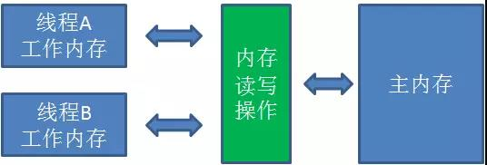

这里需要解释几个概念：

1. ##### 主内存(Main Memory)

   主内存可以简单理解为计算机当中的内存，但又不完全等同。主内存被所有的线程所共享，对于一个共享变量(比如静态变量，或是堆内存中的实例)来说，主内存当中存储了它的"本尊"

2. ##### 工作内存(Working Memory)

   工作内存可以简单理解为计算机当中的CPU高速缓存，但又不完全等同。每一个线程都拥有自己的工作内存，对于一个共享变量来说，工作内存当中存储了它的"副本"。

   **线程对共享变量的所有操作都必须在工作内存进行，不能直接读写主内存中的变量。**不同线程之间也无法访问必须的工作内存，变量值的传递只能通过**主内存**来进行。

   > 直接操作主内存太慢了，所有JVM才不得不利用性能较高的工作内存。这里可以类比一下CPU、高速缓存、内存之间的关系。


***

#### 二.JMM工作流程

​	对于一个静态变量

​	`static int s = 0;`

​	线程A执行如下代码：

​	`s = 3;`

​	JMM的工作流程如下图所示：

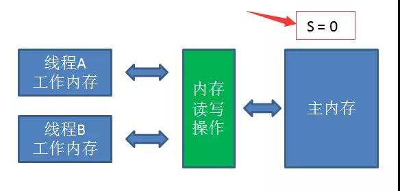

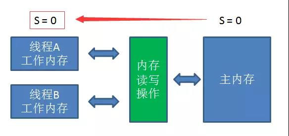

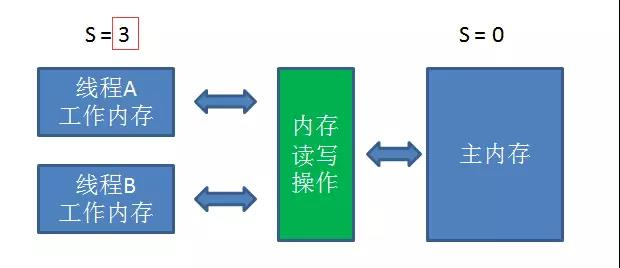

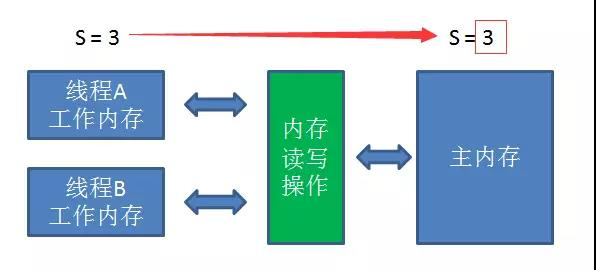

​	通过一系列内存读写的操作指令(JVM内存模型共定义了8种内存操作指令(后面会提到)，线程A把静态变量`s = 0`从主内存读到工作内存，再在工作内存把`s = 3`的更新结果同步到主内存中。从单线程的角度来看，这个过程没有任何问题。

​	这时候我们引入线程B，执行如下代码：

​	`System.out.println("s=" + s);`

​	输出结果**即有可能是3，也有可能是0**

​	引入线程B以后，当线程A首先执行，更大的可能是出现下面情况：


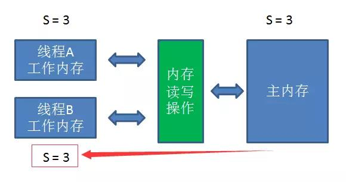

​	此时线程B从主内存得到的s值是3，理所当然输出s = 3，这种情况不难理解。但是，有较小的几率出现另外一种情况：


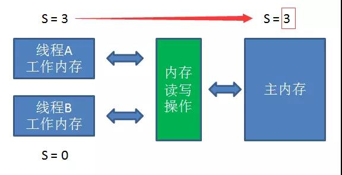

​	因为工作内存所更新的变量并不会立即同步到主内存，所有虽然线程A在自己的工作内存当中已经把变量s的值更新成3，但是线程B从主内存得到的变量值任然是0，从而输出`s = 0`。

**"怎么才能解决这个问题？是不是要使用synchronized关键字？"**

**"同步锁虽然可以保证线程安全，但是对程序性能的影响太大了，有一种轻量级的解决方法，也就是我们的主角[volatile]。"**

***

#### 三.volatile介绍

​	volatile关键字具有许多特性，其中最重要的特性就是保证了用volatile修饰的变量对所有线程的**可见性**。即当一个线程修改了变量的值，新的值会立刻同步到**主内存**中。而其它线程读取这个变量的时候，也会从主内存中立刻读取到**最新的变量值**。

​	为什么volatile关键字可以有这样的特性?这得益于java语言的**先行发生原则(happens-before)**。先行发生原则在维基百科上的定义如下：

> In computer science, the happened-before relation is a relation between the result of two events, such that if one event should happen before another event, the result must reflect that, even if those events are in reality executed out of order (usually to optimize program flow). 

​	翻译结果如下:

​	在计算机科学中，先行发生原则是两个事件的结果之间的关系，如果一个事件发生在另一个事件之前，结果必须反映，即使这些事件实际上是**乱序**执行的(通常是优化程序流程)。

​	这里所谓的事件，实际上就是各种指令操作，比如读操作、写操作、初始化操作、锁操作等等。

​	先行发生原则作用于很多场景下，包括同步锁、线程启动、线程终止、volatile。我们这里只列举volatile相关的原则：

> 对于一个volatile变量的写操作先行发生于后面对这个变量的读操作。

​	回到上述代码例子，如果在静态变量s之前加上volatile修饰符：`volatile static int s = 0;`

​	线程A执行如下代码：`s= 3;`

​	这时候我们引入线程B，执行如下代码：`System.out.println("s=" + s)；`

​	当线程A先执行的时候，把s = 3写入主内存的事件必定会先于读取s的事件。所有线程B的输出一定是s = 3；

***

#### 四.volatile性质

**volatile只能保证变量的可见性，并不能保证变量的原子性，因此不是线程安全的，我们来看下面的例子**

```java
public class VolatileTest{
  public volatile static in count = 0;
  public static void main(String[] args){
    //开启10个线程
    for(int i = 0; i < 10; i++){
      new Thread(
        new Runnable(){
          public void run(){
            try{
			Thread.sleep(1);
            }catch(InterruptedException e){
              e.printStackTrace();
            }
            //每个线程当中让count值自增100次
            for(int j = 0; j < 100; j++){
              count++;
            }
          }
        }
      ).start();
    }
    try{
      Thread.sleep(2000);
    }catch(InterruptedException e){
      e.printStackTrace();
    }
    System.out.println("count=" + count);
  }
}
```

​	这段代码的功能是：开启10个线程，每个线程当中让静态变量count自增100次。执行之后会发现，最终count的结果值未必是1000，有可能**小于1000。**

​	使用volatile修饰的变量，为什么并发自增的时候会出现这样的问题呢？这是因为count++这一行代码本身不是原子性操作，在字节码层面可以拆分成如下指令：

```assembly
getstatic		//读取静态变量(count)	
iconst 1		//定义常量1						
iadd		//count增加1
putstatic		//把count结果同步到主内存
```

​	虽然每一次执行getstatic的时候，获取到的都是主内存的最新变量值，但是进行iadd的时候，由于并不是原子性操作，其他线程在这过程中很可能让count自增了很多次。这样一来线程所计算更新的是一个**陈旧的**count值，自然无法做到线程安全：

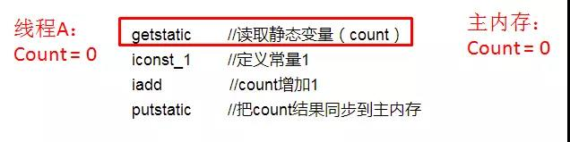

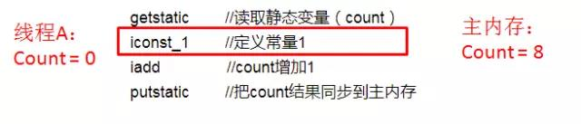

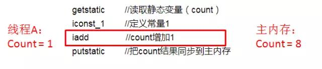

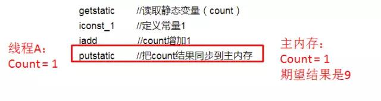

​	因为，什么时候适合用volatile呢？

1. **运行结果并不依赖变量的当前值，或者能够确保只有单一的线程修改变量的值。**

2. **变量不需要与其他状态的变量通过参与不变的约束。**

   第一条很好理解，就是上面的代码例子。第二条可以看看下面这个场景：

   ```java
   volatile static int start = 3;
   volatile static int end = 6;

   线程A执行如下代码：
   while (start < end){
     //do something
   }

   线程B执行如下代码：
   start+=3;
   end+=3;
   ```

   ​	这种情况下，一旦在线程A的循环条件判断中执行了线程B，start有可能先更新为6，造成一瞬间`start == end` ，从而跳出while循环的可能性。

***

#### 五.volatile指令重排