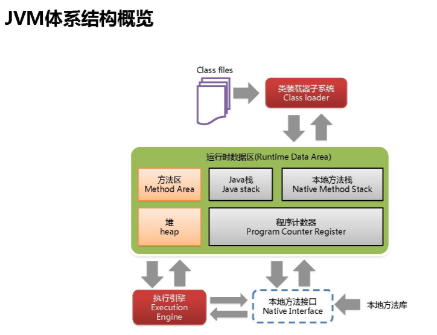
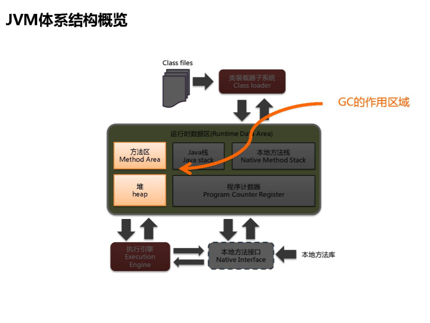
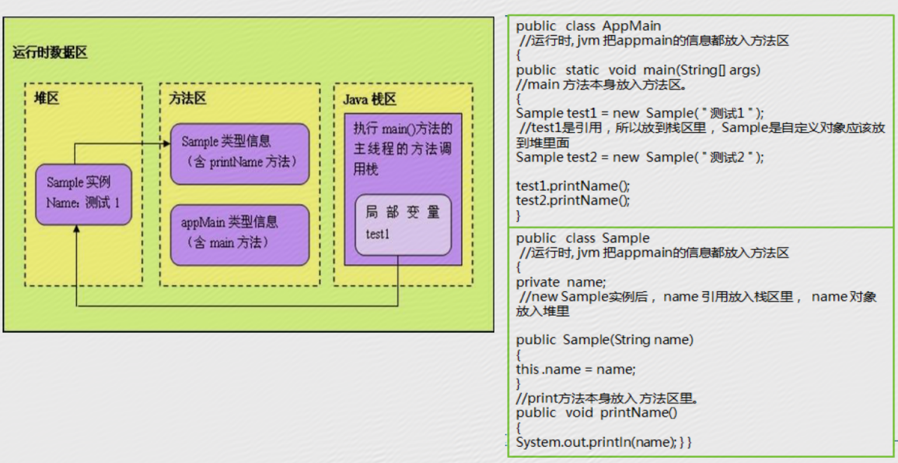
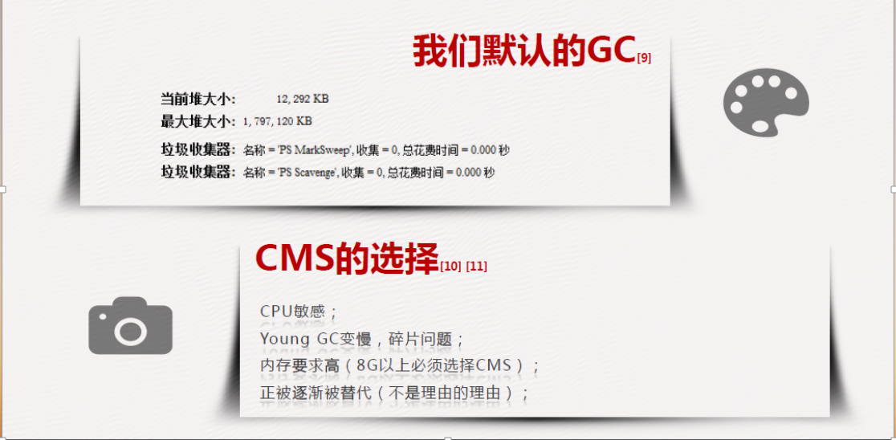

## JVM浅谈

[TOC]

#### 一.java虚拟机的内部体系结构





***

#### 二.java堆

​	在堆的管理上，Sun JDK从1.2版本开始引入分代管理方式。主要分为新生代、旧生代，分代方式大大改善了垃圾回收的效率。

* **新生代(New Generation)**
  大多数情况下新创建的对象被分配在新生代中，新生代由**Eden Space**和两块相同大小的**Survivor Space**组成。

* **旧生代(Old Generation/Tenuring Generationg)**

  在**新生代**中存活时间较久的对象将会被转入**旧生代**，旧生代进行垃圾回收的频率没有新生代高

***

#### 三.java方法区

**类型信息**和类的**静态变量**都存储在**方法区**中。**方法区**中对于每个类存储了以下数据：

1. 类及其父类的全限定名(java.lang.Object没有父类)

2. 类的类型(Class or Interface)

3. 访问修饰符(public、abstract、final)

4. 实现的接口的全限定名的列表

5. 常量池

6. 字段信息

7. 方法信息

8. 静态变量

9. ClassLoader的引用

10. Class的引用

  可见类的所有信息都存储在方法区中。由于方法区所有的线程是共享的，所以必须保证线程安全。

举例来说，如果两个类同时加载一个尚未被加载的类，那么一个类会请求它的ClassLoader去加载需要的类，另一个类只能等待而不会重复加载。

#### 四.栈、堆、方法区交互



#### 五.元空间

**元空间：再见PermGen，你好MetaSpace**

1. 永久代在JDK8中被完全移除了。所以永久代的参数-XX：PermSize和 -XX：MaxPermSize也被移除了。
2. JDK8以后，JVM不再有PermGen。但类的元数据信息(metadata)还在，只不过不再是存储在连续的堆空间上，而是移动到叫做"Metaspace"的本地内存(Native Memory)中。

原因：类的元数据信息转移到Metaspace的原因是PermGen很难调整。PermGen中类的元数据信息在每次FullGC的时候可能会被收集，但成绩很难令人满意。而且应该为PermGen分配多大的空间很难确定，因为PermSize的大小依赖于很多因素，比如JVM加载的Class的总数，常量池的大小，方法的大小等。

***

#### 六.永久代的移除

​	**永久代的移除对最终用户意味着什么？**

​	由于类的元数据可以在本地内存(Native Memory)之外分配，所以其最大可利用空间是整个内存的可用空间。这样，你将不再会遇到OOM错误，溢出的内存也会拥入到交换空间。最终用户可以为类元数据指定最大可利用的本地内存空间，JVM也可以增加本地内存空间来满足类元数据信息存储。

​	注：永久代的移除并不意味着类加载器泄露的问题就没有了。因此，你仍然需要监控你的消费和计划，因为内存泄露会耗尽本地内存，导致内存交换(swapping)，这样只会变得更糟。

***

#### 七.JVM参数

​	-Xms和-Xmx设为一样大

​	JVM的堆大小决定了JVM花费在收集垃圾上的时间和频度。

​	如果堆的大小很大，那么完全垃圾收集就会很慢，但是频度会降低。

​	如果堆得大小和内存的需要一致，完全收集就会很快，但是会更加频繁。

​	调整堆大小的目的是最小化垃圾收集时间，以在特定的时间内最大化处理客户的请求。

​	一次完全的垃圾收集应该不超过3-5秒。如果垃圾收集成为瓶颈，那么需要指定堆的大小，检查垃圾收集的详细输出，研究垃圾收集参数堆性能的影响。我们一般把-Xms和-Xmx设为一样大，而堆的最大值受限于系统使用的物理内存。一般使用数据量较大的应用程序会使用持久对象，内存使用有可能迅速地增长。当应用程序需要的内存超出堆的最大值时虚拟机就会提示内存溢出，并且导致应用程序崩溃。因此一般建议堆的最大值设置为可用内存最大值的80%。

​	-Xms == -Xmx？	Not Alway！

* 设置-Xms的堆预期大小
  * 堆调整的代价很大
* **如果内存允许，设置-Xmx比-Xms更大的值**
  * 以防万一
  * 也许系数负载比你想的要重
  * 随着时间的推移，数据量越来越大
* 进行一个**Full GC & 堆调整**调整总比发生**OOM & 宕机**好


​	从上面的的推导可以得出很多结论，下面是前辈的经验总结和自己的认识：

1. JVM堆的大小决定了GC的时间。如果JVM堆大小超过一定的限度，那么GC的运行时间会很长。

2. 对象的生存时间越长，GC需要的回收时间也越长，影响了回收速度。

3. 应用程序中，建立与释放对象的速度决定了垃圾收集的频率。

4. 如果GC一次运行周期超过3-5秒，这会很影响应用程序的运行，如果可以，应该减少JVM堆的大小了。

5. 前辈经验之谈：通常情况下，JVM堆的大小应该为物理内存的80%。 

   ​

***


#### 八.代码方面的优化

1. ##### 尽量避免随意使用静态变量

   ​	当某个对象被定义为static 变量所引用，那么gc通常是不会回收这个对象所占的内存，如：

   ```java
   public class A{
     static B b = new B();
   }
   ```

   ​	此时静态变量b的生命周期与A类同步，如果A类不会卸载，那么b对象会常驻内存，直到程序终止。特别注意一些像HashMap、ArrayList的集合对象，它们经常会引发内存泄露。当它们被生命为static时，它们的生命周期就会和应用程序一样长。

   ​

2. ##### 尽早释放无用对象的引用

   ​	好的办法是使用临时变量的时候，让引用变量在退出活动域后自动设置为null，按时垃圾收集器来收集该对象，以防止内存泄露

   ​	注意，当局部变量不需要时，不需明显的设为Null，因为一个方法执行完毕时，这些引用会自动被清理。

    	因此，将变量的作用域设置为最小是必须的，通用这也是封装原则。	

   ​

3. ##### 避免集中创建对象尤其是大对象

   ​	JVM会突然需要大量内存，这时会触发GC内存优化系统内存环境，一个案例如下：

   ​	很久以前，使用jspsmartUpload组件作为文件上传，在运行过程中经常出现java.OutOfMemoryError错误，用top命令查看进程使用情况，发现内存不足2M，花了很长时间，发现是jspsmartUpload的问题。把jspsmartupload组件的源码文件(.class文件)反编译成java文件，我们发现

   ​	m_totalBytes = m_request.getContextLength();

   ​	m_binArray = new byte[m_totalBytes];

   ​	变量m_totalBytes表示用户上传的文件的总长度，这是一个很大的数。如果用这样大的数去声明一个byte数组，并给数组的每个元素分配内存空间，而且m_binArray数组不能马上释放，JVM的垃圾回收确实有问题，导致结果就是内存溢出。
   ​

4. ##### 检查List、Map等集合对象是否有使用完后未清除的问题

   ​	要让垃圾收集(GC) 回收程序不再使用的对象，对象的逻辑生命周期和对该对象拥有的引用的实际生命周期必须相同。在大多数时候，好的软件工程技术保证这是自动实现的，不用我们对对象生命周期花费过多心思。但是偶尔我们会创建一个引用，它在内存中包含对象的时间比我们预期的要长的多，这种情况成为**无意识的对象保留**(unintentional object retention)

下面给出一个简单的内存泄露的例子。在这个例子中，我们循环申请Object对象，并将申请的对象放入一个Vector中，如果我们仅仅释放引用本身，那么Vector仍然引用该对象，所以这个对象对GC来说是不可回收的。

```java
List<Object> v = new ArrayList<Objet>(10);
for(int i = 0; i < 100; i++){
  Object o = new Object();
  v.add(o);
  o = null;
}
```

函数内，如果可以清除，清除集合中对象：v.clear();


***


#### 九.JDK9在垃圾回收方面的变化

1. ##### 删除jdk8弃用的垃圾回收集合

   * **DefNew + CMS**
   * **PerNew + SerialOld**
   * **Incremental CMS**

2. ##### foreground的CMS GC删除

3. ##### 一些jvm参数去掉

   * -Xincgc
   * -XX：+ CMSIncrementalMode
   * -XX：+ UseCMSCompactAtFullCollection
   * -XX：+ CMSFullGCsBeforeCompaction
   * -XX：+ UseCMSCollectionPassing

4. ##### 使用G1做为默认回收器

5. ##### 统一GC日志

6. ##### 废弃CMS

   ​	其实通过上面好多项都可以看见把CMS参数去掉很多，之后一些相关也废弃了，就是想让G1替代CMS，由于CMS采用的是**标记清除算法**，而G1使用的是**标记整理算法**，所以G1在若干次GC后，不需要类似CMS那样必须进行一次碎片整理

   


##### 总结：

CMS ：CMS是一款优秀的收集器，主要优点：并发收集、停顿低

缺点：

​	1.对CPU资源非常敏感

​	2.无法处理浮动垃圾

​	3.产生内存碎片	

G1：G1是一款面向服务端应用的垃圾收集器    

特点：   

​	 1.标记整理

​	2.可预测停顿

​	3.并行于并发

​	4.分代收集


